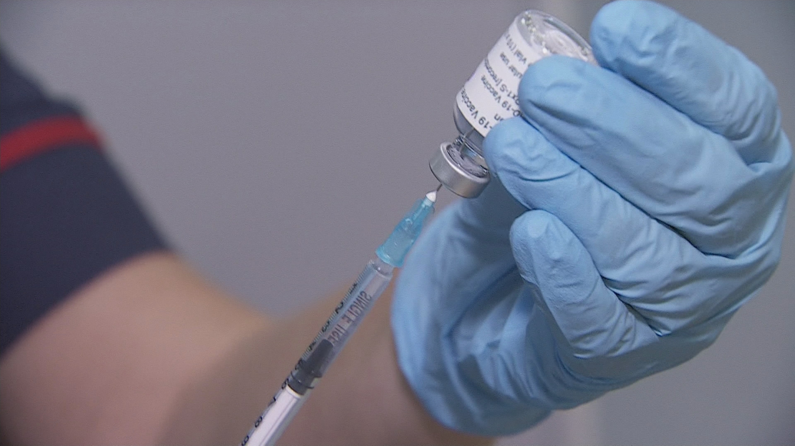

# Predict H1N1 and Seasonal Flu Vaccines - ML_Assignment_02

## Group Members
1. Rogin Harshini N. V  - IT19125244
2. Manilka G. S. - IT19074450
3. P. J. Samuel  - IT19364216
4. Wickramasinghe A. Y. S. W - IT19038292

## Description
The goal of this project is to predict how likely individuals are to receive their H1N1 and seasonal flu vaccines. As such, it is necessary to predict two probabiblities, one for H1N1 and one for seasonal flu vaccine.The
performance will be evaluated according to the area under the receiver operating characteristic curve
(ROC AUC) for each of the two target variables. The mean of these two scores will be the overall score, with higher values indicating stronger performance.

In this project we used four modeling methods: Random Forest Classifier, Logistic Regression, Decision Tree Classifier, Catboost classifier and we used a dataset from  drivendata to  find patterns and regularities using data mining technique to predict how likely individuals are to receive their H1N1 and seasonal flu vaccines. Dataset is available under drivendata as Feature data.

## Conclusions

We tried different methodologies to predict the results regarding the prediction of H1N1 and Seasonal Flu Vaccines such as Random Forest Classifier, Logistic Regression, Decision Tree Classifier, Catboost classifier and we got a best score 0.8632 using Catboost classifier

## preprocessing
Data preprocessing is a data mining technique used to convert raw data into a usable and efficient format. Cleansing, transformation, and feature engineering are all part of data preprocessing
